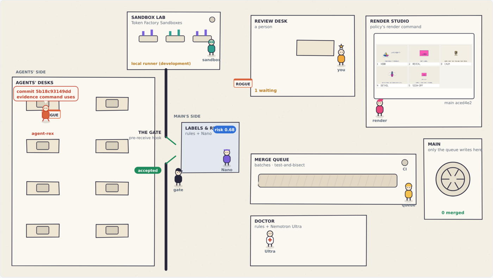
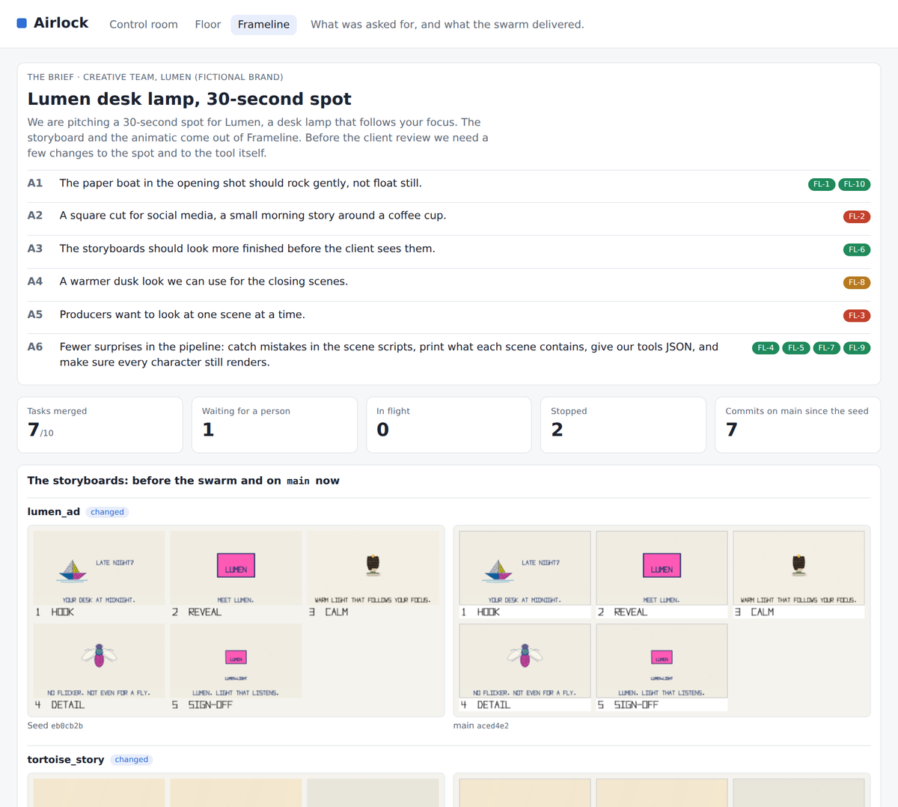

# Airlock

**A git gateway for agent swarms: nothing reaches `main` without reproducible evidence, and only risky changes reach a human.**

Airlock is our entry for the Nebius x NVIDIA Global AI Hackathon (Coding and Agentic Engineering track). It runs a swarm of Nemotron agents on a real Rust project, Frameline, and puts one gate between them and `main`.



## The problem

When ten or a hundred coding agents work in parallel, human review becomes the bottleneck. The pull-request queue grows without bound, or reviews turn into approvals without reading. If an agent cannot verify its own work, you are still the verification system.

## How Airlock works

1. **Agents propose; code decides.** Each agent asks Nemotron 3 Super for edits in a strict SEARCH/REPLACE format, runs the task's check and pushes one commit. That commit cites the command that passed in an `Airlock-Evidence` trailer. The model never runs a command and never touches git.
2. **One door to `main`.** A `pre-receive` hook sends every push to a deterministic gate. The gate checks protected refs, each agent's own branch namespace, forbidden paths, secrets, deleted or skipped tests, and a well-formed evidence trailer with an allowed command. Refused pushes never land. No model takes part in this decision.
3. **Evidence that anyone can repeat.** Airlock re-runs the cited command on the pushed commit in a clean Token Factory Sandbox, with no network. A change whose evidence does not reproduce is rejected before anyone looks at it.
4. **Human attention as a budget.** Rules and Nemotron 3 Nano label each change from closed vocabularies, and a noisy-OR turns the labels into a risk score. The threshold adapts so the reviewer's queue stays under a target load (ρ ≤ 0.7). Visual changes always go to a person, who sees the boards and animatics before and after.
5. **Batches, not queues of one.** Everything else merges in batches on top of `main`. A red batch is split in halves until the broken change is isolated. When a change fails, rules name the category and Nemotron 3 Ultra names the culprit file and the next step. The agent that retries the task receives that diagnosis.

## What you can see

The service has three tabs:

| Tab | What it shows |
| --- | --- |
| **Floor** (`/floor`) | The architecture as a place: agents at their desks, the gate, the sandbox lab, labels and risk, the review desk, the merge queue, `main`, the doctor and the render studio. **Live** mode follows what happens. **Replay** plays a past session back at a watchable speed. **Explain** walks through the nine components. |
| **Control room** (`/dashboard`) | The numbers: human load ρ, the risk threshold, the batch size, the swarm's agents, changes by state with their labels, merge batches and gate decisions. |
| **Frameline** (`/frameline`) | What was asked for and what came out: the brief, the tasks derived from it and their status, the storyboards before the swarm and on `main`, the latest render and animatic, and the visual review with approve and reject. |



## Status

Built and tested (116 tests):

- The push gate and the `pre-receive` hook.
- Labels and risk, human-attention control, and the batched merge queue with test-and-bisect.
- Agent workers and the swarm (agentkit Flow).
- Failure diagnosis, and the scripted misbehaving agent.
- The three tabs.
- Frameline with visual regression tests.
- A one-VM deployment (`deploy/`): Docker Compose with Postgres, the service and Caddy, and Solid Queue running inside Puma. The production configuration has been run end to end on a test machine, but the image has not been built there.

Measured with live Nemotron calls on Token Factory:

- Workers, run with Nemotron 3 Super on the Frameline backlog. Of 10 tasks, 7 are merged, 1 waits for review, 1 was rejected by a reviewer and 1 was given up (see [docs/workers.md](docs/workers.md)).
- Labels from Nemotron 3 Nano.
- A failure diagnosed by Nemotron 3 Ultra.

Waiting or not built yet:

- **Token Factory Sandboxes.** The client, the evidence re-run and the render runner are built and tested against a fake API, but our account is waiting for beta access. Until then, checks run on a local runner, and the Floor and the logs say so.
- **Running on Nebius AI Cloud.** The deployment is ready ([deploy/README.md](deploy/README.md)) and runs checks on the local runner until Sandboxes are enabled. A container runner (`--network none`) comes next.
- **A prebuilt Rust image for the sandbox.** See [sandbox/README.md](sandbox/README.md).
- **Not built:** sampled audits of auto-merged changes, summaries of escalated changes by Nemotron 3 Super, and visual checks of rendered boards by a vision model. The backlog is written by hand from the brief; turning a brief into tasks is not automated.

## Layout

| Path | Contents |
| --- | --- |
| `control/` | The Airlock service (Rails 8 and agentkit-rails): gate, labels and risk, merge queue, workers and swarm, diagnosis, renders, the three tabs |
| `hooks/pre-receive` | Git server hook that sends every push to the gate |
| `demo/brief.yml` | The request the swarm works from (a made-up brand, Lumen) |
| `demo/backlog.yml` | Tasks written from the brief, each with its context files and the check its evidence cites |
| `demo/frameline/` | Frameline, the demo target: storyboards and animatics from YAML, built on the `taller_film` renderer |
| `deploy/` | Dockerfile, Compose file, Caddy and a bootstrap script for one VM |
| `sandbox/` | Notes for the Token Factory Sandboxes image |
| `docs/` | Architecture, evidence, risk, workers, and how to run the demo |
| `airlock.toml.example` | An annotated policy |

## Models and services

| Model or service | Used for |
| --- | --- |
| NVIDIA Nemotron 3 Super (`nvidia/nemotron-3-super-120b-a12b`) | Agent workers, with reasoning on |
| NVIDIA Nemotron 3 Nano (`nvidia/NVIDIA-Nemotron-3-Nano-30B-A3B`) | Three semantic labels per change, three votes each |
| NVIDIA Nemotron 3 Ultra (`nvidia/Nemotron-3-Ultra-550b-a55b`) | Diagnosis of changes that fail in the merge queue |
| Nebius Token Factory | OpenAI-compatible API for all three models |
| Token Factory Sandboxes | Evidence re-runs, CI and renders (integrated; waiting for beta access) |

## Quick start

```sh
cd control
bundle install
bin/rails db:prepare
bin/rails test
```

To run the whole demo (seed the Frameline repository behind the gate, start the service, run the swarm and the misbehaving agent), follow [docs/demo.md](docs/demo.md).

## Documentation

- [docs/architecture.md](docs/architecture.md): the components and the path of a change.
- [docs/evidence.md](docs/evidence.md): the evidence trailer, and how Airlock re-runs it in a sandbox.
- [docs/risk.md](docs/risk.md): labels, the risk score, human attention and batch size, with the math.
- [docs/workers.md](docs/workers.md): agent workers and the swarm, and what the live runs with Nemotron taught us.
- [docs/demo.md](docs/demo.md): running the demo, the misbehaving agent, failure diagnosis, the Frameline tab and the Floor.
- [control/README.md](control/README.md): the service's environment, endpoints and tasks.
- [deploy/README.md](deploy/README.md): deploying on a VM (Nebius AI Cloud).

## License and credits

Apache License 2.0. See [LICENSE](LICENSE).

Frameline is built on Enrique Meza's `taller_film` renderer. The Floor's art is drawn in code for this project; it uses no third-party assets. The Floor was inspired by [pixel-agents](https://github.com/pixel-agents-hq/pixel-agents).
