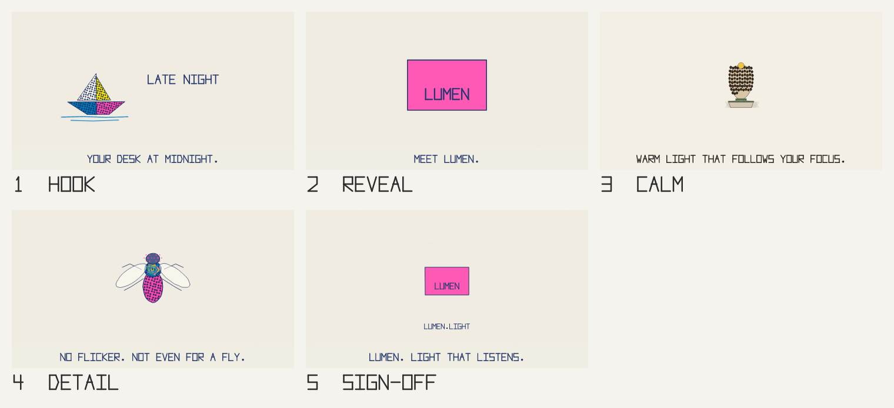

# Frameline

Frameline turns a short YAML spec into a storyboard and an animatic. It is the
demo repository for Airlock: the agent swarm changes Frameline, and Airlock
decides what reaches `main`.

Frameline is built on **taller_film**, Enrique Meza's Rust renderer for
paper-cutout animation (tiny-skia plus rayon, exported with ffmpeg). The crate
keeps the name `taller_film`; the Frameline parts are `src/spec.rs`,
`src/board.rs`, `src/bin/frameline.rs`, `examples/specs/` and `tests/`.



## Usage

```sh
cargo build --release --bin frameline
./target/release/frameline check examples/specs/lumen_ad.yaml
./target/release/frameline board examples/specs/lumen_ad.yaml -o board.png --tile-width 480
./target/release/frameline animatic examples/specs/tortoise_story.yaml -o story.mp4 --width 540
```

`board` draws the middle frame of every scene on one numbered grid. `animatic`
renders the full video at 24 fps with a silent audio track and needs `ffmpeg`
on the `PATH`.

## The spec

A spec is a closed vocabulary, so an agent can only write what the renderer
can draw. Unknown fields, values outside a list, out-of-range numbers and
characters the vector font cannot draw are rejected with the scene they came
from.

| Field | Values |
|---|---|
| `format` | `1:1`, `16:9`, `9:16` |
| `style` (film or scene) | `paper_ink`, `riso_pop`, `screen_sea`, `pencil_minimal`, `blueprint_night` |
| `scenes[].duration` | 0.5 to 20 seconds, at most 24 scenes |
| `scenes[].shot` | `wide`, `medium`, `close_up` |
| `scenes[].camera` | `from` and `to`, each `{x, y, zoom}`: x and y in 0–1, zoom 0.5–4, eased |
| `scenes[].caption` | up to 80 characters: letters, digits, space and `.:-/°(),'!?` |
| `elements[].kind` | `boat`, `fly`, `balloon`, `tortoise`, `product`, `text` (the last two need a `label`); at most 8 per scene |
| `elements[].x`, `y` | 0–1, relative to the frame |
| `elements[].scale` | 0.1–4 |
| `elements[].motion` | `still`, `bob`, `drift`, `rise` |

## Tests

```sh
cargo test --release
```

`tests/spec.rs` checks validation. `tests/visual.rs` renders every spec in
`examples/specs/` as a small board and compares it with `tests/golden/`. A
pixel counts as changed when a channel moves by more than 24 of 255, and a
board fails when more than 2 pixels change; rendering is deterministic, and a
one-letter caption edit changes about 10 pixels. On failure the test writes
`tests/golden/<name>.actual.png` next to the golden. To accept a visual change
on purpose, run `UPDATE_GOLDEN=1 cargo test --release --test visual` and commit
the new goldens with the change, so the reviewer sees the new board.

## What is not included

The music that some taller_film films use belongs to third parties and is not
part of this repository. Those films look for files under `assets/` at run
time and render without them. Frameline itself uses no audio.
