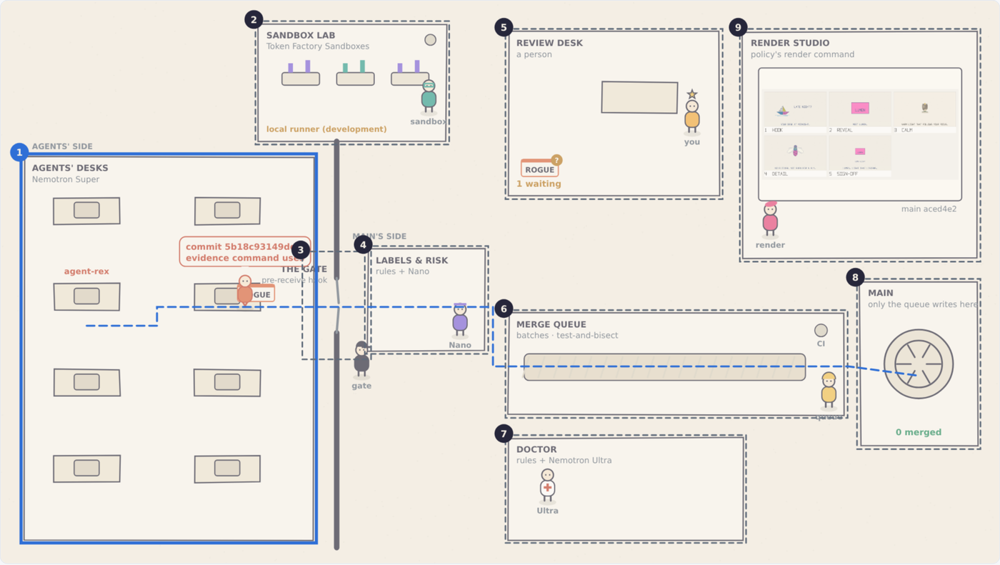
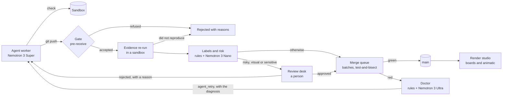

# Architecture

Airlock keeps the source of truth in git, puts one gate in front of `main`, and
lets models advise but never decide. Everything that decides is code in
`control/app/services/airlock/`, driven by a policy file.

## Layers

| Layer | In Airlock | Runs on | Rule |
| --- | --- | --- | --- |
| Truth | Bare git repositories with a protected `main` | The Airlock host (`AIRLOCK_GIT_ROOT`) | Never lives inside an agent or a sandbox |
| Control | Gate, labels and risk, merge queue, workers, diagnosis, renders, the three tabs | The Rails service in `control/` | Deterministic code; models only advise |
| Execution | Checks, evidence re-runs, CI and renders | Token Factory Sandboxes (a local runner until our beta access arrives) | A clean copy of the committed tree, no network |
| Policy | Paths, labels, routing, risk, evidence commands, render command | `control/config/airlock/airlock.toml` | Written by people |

## Components

The numbers match the Floor's Explain mode.

1. **Agent workers** (`worker.rb`, `edits.rb`, `swarm.rb`, `app/flows/swarm_flow.rb`). A worker takes one backlog task. It asks Nemotron 3 Super for SEARCH/REPLACE edits and applies them in its own clone, with paths confined to the tree. It runs the task's check and feeds failures back, for up to six attempts. It then pushes one squashed commit with `Airlock-Task` and `Airlock-Evidence` trailers. `SwarmFlow` (agentkit Flow) spreads the backlog over several agents; each agent's share runs as its own job. See [workers.md](workers.md).
2. **Runners and sandboxes** (`runners/`, `sandboxes/client.rb`, `collector.rb`). Every command runs in a runner. `Runners::Sandbox` archives the committed tree, uploads it to Token Factory Sandboxes and runs the command there with networking off; generated files (golden images, renders) come back through a checked tarball. `Runners::Local` exists for development, and each tree builds in its own `target/`. See [evidence.md](evidence.md).
3. **The gate** (`hooks/pre-receive`, `gate.rb`, `Gate::PushesController`). The hook summarizes each ref update (commits, changed files, added lines) and posts it to `POST /gate/push`. The gate refuses:
   - pushes to protected refs, except by the merge queue;
   - pushes outside the agent's own `agents/<name>/` namespace;
   - forbidden paths;
   - secrets;
   - deleted test files and new skip markers;
   - commits without a valid evidence trailer or with a command not on the allowlist.

   The hook fails closed. A push that rewrites a branch is judged like a new branch, so an agent is never blamed for commits `main` gained in the meantime.
4. **Labels and risk** (`labels.rb`, `labeler.rb`, `risk.rb`, `intake.rb`). Rules label what they can read from the diff (area, blast radius, test signal, dependencies). Nemotron 3 Nano votes three times on three semantic labels (change type, goal clarity, safety flag). All values come from closed vocabularies. A noisy-OR combines the labels and the agent's failure rate into a risk score. See [risk.md](risk.md).
5. **The review desk** (`attention.rb`, `review.rb`, the Frameline tab). Some changes go to a person:
   - sensitive paths, including changed golden images;
   - labels listed in `[routing] human_when`;
   - risk above a threshold. The threshold adapts so the reviewer's load stays under a target (ρ ≤ 0.7).

   Reviewers approve or reject in the Frameline tab or through the reviews API. A rejection's reason is kept and handed to the next agent that takes the task.
6. **The merge queue** (`merge_queue.rb`, `batch_math.rb`, `MergeQueueJob`).
   - It tests queued changes in batches on top of `main`. A red batch is split in halves until the broken change is isolated, and the surviving set is tested together once more.
   - The batch size minimizes CI runs for the agents' current failure rate.
   - One batch runs per repository, under a Postgres advisory lock that bypasses the query cache.
   - A batch left running by a dead process is recovered.
   - `MergeQueueSweepJob` wakes the queue when the server boots.
7. **The doctor** (`diagnosis.rb`, `DiagnoseFailureJob`). When the queue fails a change, rules name the category: merge conflict, interaction, compile error, visual regression, test failure or infrastructure. Nemotron 3 Ultra adds the culprit files, a short explanation and a next step (`agent_retry`, `human` or `drop`), all checked against the change's files and the vocabulary. `agent_retry` tasks are offered to the swarm again with the diagnosis; the others wait for a person.
8. **`main`**. Only the merge queue updates it, and it does so through the same gate. It checks afterwards that `main` contains every change it merged.
9. **The render studio** (`RenderJob`, `renders.rb`). After every green batch, and for every visual change sent to review, the policy's `[render]` command draws the boards and the animatic through the same runner as CI. The Frameline tab and the Floor show them.

Two records sit beside these components:

- **The audit log.** agentkit's signed, hash-chained log records gate decisions, routing, evidence, reviews, batches, diagnoses and renders. It is the record of truth.
- **`FloorEvent`.** A closed vocabulary of presentation events that feed the Floor. Emitting one is best effort and never fails the operation that emits it.

## Path of a change

## Service map

| Endpoint | Purpose |
| --- | --- |
| `POST /gate/push` | Called by the hook; returns the gate's decision |
| `GET /dashboard` (and `/`) | Control room, HTML or JSON |
| `GET /floor`, `/floor/state`, `/floor/events`, `/floor/sessions` | The Floor and its data |
| `GET /frameline` | The Frameline tab, HTML or JSON |
| `GET /frameline/golden/:sha/:name`, `/frameline/renders/:sha/:name` | Golden images from git and renders of a commit, by full commit id only |
| `/frameline/reviewer`, `POST /frameline/reviews/:id/approve\|reject` | Reviewer sign-in and decisions from the browser |
| `GET /reviews`, `POST /reviews/:id/approve\|reject\|label` | Reviews API (bearer token) |

The three tabs are read-only for everyone except a signed-in reviewer. They show no push contents, prompts or secrets.

## Not built yet

- Sampled audits of auto-merged changes (`[audit] sample_rate` is reserved).
- Summaries of escalated changes by Nemotron 3 Super.
- Visual checks of rendered boards by a vision model.
- Turning a brief into backlog tasks automatically.
- A deployment on Nebius, including the Solid Queue configuration.
